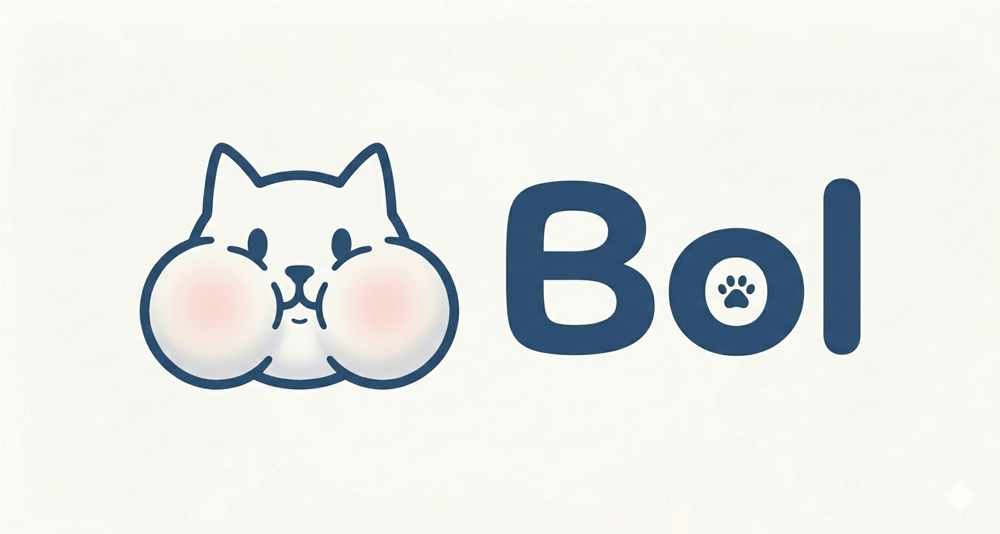

[](https://forms.gle/QrFAaXgbLnsxywhA7)

# bol

<div align="center">



Gacha calculator for [Trickcal: Chibo Go](https://trickcal.biligames.com/en/) <br/>
트릭컬 가챠 확률 계산기.


</div>

# Table of contents

- [introduction](#introduction)
- [installation](#installation)
- [reference](#reference)

## introduction

<table>
  <tr>
    <td width="200" align="center">
      
    </td>
    <td valign="center">
      <h3>Rationale</br>만든 이유</h3>
      <p>because krepe is insanely cute. <br/>and wanted to mess around with rust.<br/>귀엽잖아요.</br>그리고 러스트 좀 보려고요.</p>
    </td>
  </tr>
</table>

img ref: [[트릭컬][duckov] 우리 중에 스파이가 있어](https://youtu.be/riwHKAEiWE8?si=c_u6SqcVelHNTHHq)

## installation

install rust with asdf.<br/>
쭉 설치하세요.

```sh
asdf plugin add rust
asdf list all rust
asdf install rust stable
```

refresh asdf paths.<br/>
패스 등록해주시고,

```sh
asdf reshim
```

anchor versions in `.tool-versions`.<br/>
버전 명시도 해줍니다.

```
rust stable
rustc 1.93.1
rustup 1.28.2
cargo 1.93.1
```

## reference

- [Trickcal:Chibi Go 공략 - 모집 가이드](https://www.bluestacks.com/ko/blog/game-guides/trickcalchibi-go/tlcg-gacha-guide-ko.html)
- [Easy Rust Korean / Rust in a Month of Lunches 한국어판](https://youtube.com/playlist?list=PLfllocyHVgsSJf1zO6k6o3SX2mbZjAqYE&si=jLtomnTOG4PlWIpS)
- [rust by example: Unit testing](https://doc.rust-lang.org/rust-by-example/testing/unit_testing.html)
- [Rust Programming | Spawn Thread 🦀](https://youtube.com/shorts/rLcaR7j5oKk?si=-w7jYcAJGFhhXf04)
- [[트릭컬][duckov] 우리 중에 스파이가 있어](https://youtu.be/riwHKAEiWE8?si=c_u6SqcVelHNTHHq)
